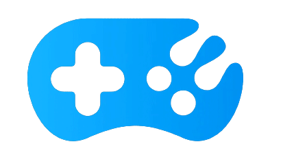
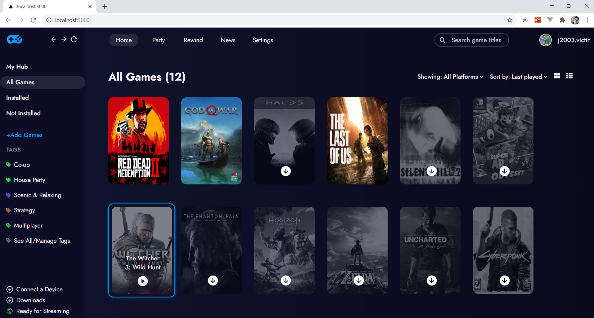

 <h1> 
    
    React Games
  </h1>
  
  

## 🚀 Tecnologias

Esse projeto foi desenvolvido com as seguintes tecnologias:

- [Node.js](https://nodejs.org/en/)
- [React](https://reactjs.org)
- [TypeScript](https://www.typescriptlang.org/)
- [Next.js](https://nextjs.org/)
- [Sqlite](https://www.sqlite.org/index.html)

## 💻 Projeto

React Games é um projeto com intuito de aperfeiçoar e melhorar meus estudos com React, Nodejs e Nextjs. Inpirado em launchers e loja de games como Epic Games e Steam, nele
é possivel ver os games que estão adicionados na conta de um usuário ficticío, tanto
instalados como não-instalados, na home é possivel instalar um game, mudando o estado
e a cor do game, é possivel procurar na barra de pesquisa algum game e também é
possivel ver todos os games de uma determinada plataforma, trocando as options
do select

## 🔖 Layout
Este layout foi inspirado em um projeto do dribble.

- [Layout](https://dribbble.com/shots/10799678-Rainway-Dashboard-2-0/attachments/2459515?mode=media)

<strong>Em breve layout para mobile!</strong>
## 📁 Scripts

Encontre o servidor nesse repositório: https://github.com/Joao-Rodrigues01/api-react-games

Para rodar a aplicação web utilize:
- yarn dev

<strong> Logo mais novas atualizações! </strong>
